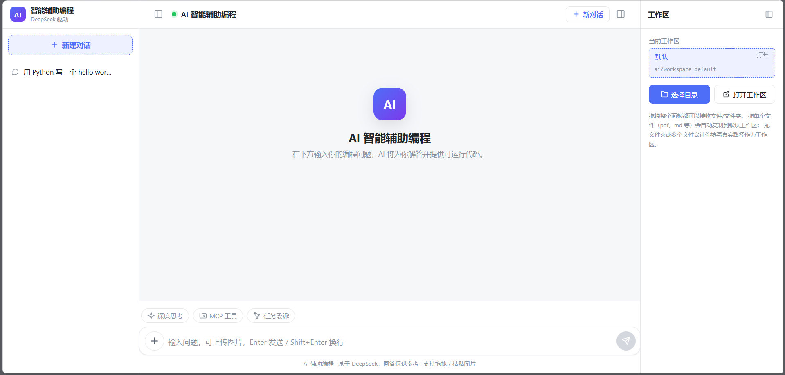
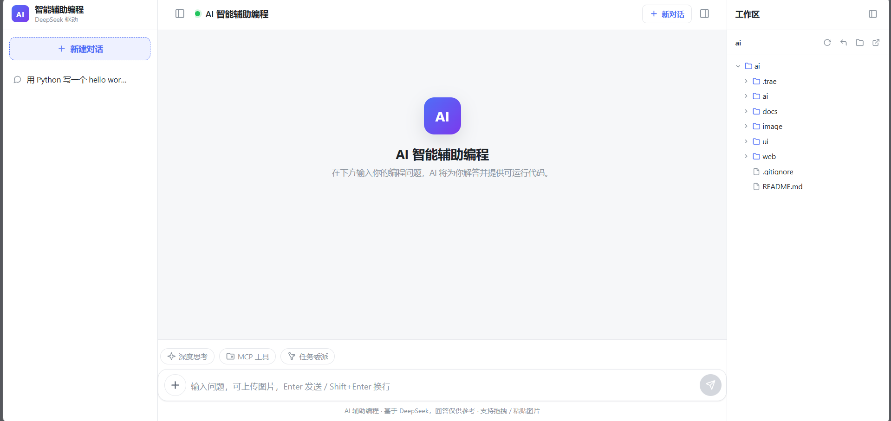

# AI 智能辅助编程

一个面向编程与软件开发场景的 AI 辅助编程助手，支持流式对话、多图片输入、深度思考模式、工作区工具调用（只读/写入/命令执行）、RAG 语义检索、MCP 外部工具接入与多 Agent 子任务委派。

> **角色边界**：助手严格服务于编程与软件开发话题（代码、调试、重构、框架、算法、数据库、开发环境等）。医学/法律/金融/政治等非编程话题将被礼貌拒绝，越狱尝试（"忽略上述指令"等）一律视为无效。

---

## 目录

- [功能特性](#功能特性)
- [技术栈](#技术栈)
- [项目结构](#项目结构)
- [环境要求](#环境要求)
- [环境配置](#环境配置)
- [快速启动](#快速启动)
- [项目截图](#项目截图)
- [API 概览](#api-概览)
- [安全说明](#安全说明)

---

## 功能特性

按阶段交付，可按需开关：

| 阶段 | 功能 | 说明 |
|------|------|------|
| 0 | 流式对话 + 持久化 | SSE 流式响应、对话/消息 MySQL 落库、多图片输入（最多 4 张）、深度思考模式 |
| 1 | LangGraph 只读工具循环 | `read_file` / `list_dir` / `glob` / `grep`，工作区沙箱硬边界 |
| 2 | RAG 语义检索 | `search_code` 工具，fastembed 本地嵌入（BAAI/bge-small-zh-v1.5）+ 增量索引 |
| 3 | 本地受限沙箱 | `write_file` / `run_command`，白名单 + 黑名单 + 人机确认（confirm） |
| 3.5 | 工作区项目树 | IDE 风格目录树浏览（懒加载、剪枝、截断） |
| 4A | MCP 客户端 | 动态接入外部 MCP server（stdio 传输），未声明只读的工具一律 confirm |
| 4B | Multi-Agent 子任务委派 | `delegate_task` 只读子代理，双层预算轮次 + 超时收敛 |
| 4C | 前端功能开关 | MCP 工具 / 任务委派 pill 热切换，配置持久化到 `ai/config/features.json` |

其他工程特性：

- **记忆治理**：滑动窗口（默认 10 条）+ 增量摘要压缩，每对话独立隔离
- **Token 治理**：工具历史瘦身（尾部保留 48K 字符预算），防长对话 O(n²) 膨胀
- **图片治理**：前端上传前压缩（最长边 ≤2048px、JPEG/WebP 再编码），后端兜底 ≤4096px
- **SSE 健壮性**：断连后 AI 任务继续跑完落库，刷新可找回回复；AbortController 前端中断
- **数据库可移植**：Flyway 按方言分目录（`db/migration/{dialect}/`），换库不改业务代码
- **测试基线**：AI 模块 pytest、Web 模块 mvn test 全绿

---

## 技术栈

| 层 | 技术 | 版本 |
|----|------|------|
| 前端 | Vue 3 + Vite | Vue 3.4 / Vite 5.2 |
| 后端 | Spring Boot + Java + MyBatis-Plus | Boot 3.2.5 / Java 21 / MyBatis-Plus 3.5.7 |
| 数据库 | MySQL + Flyway + HikariCP | MySQL 8+ |
| AI 模块 | FastAPI + 原生 OpenAI SDK + LangGraph | FastAPI 0.115+ / LangGraph 1.2+ |
| AI 模型 | DeepSeek（OpenAI 兼容网关） | `deepseek-flash`（含视觉）/ `deepseek-v4-pro` |
| 嵌入模型 | fastembed（ONNX 本地） | BAAI/bge-small-zh-v1.5（512 维） |
| MCP | mcp（stdio 传输） | mcp 2.2+ |

---

## 项目结构

```
ai/
├── ai/                          # AI 模块（FastAPI）
│   ├── main.py                  # FastAPI 入口、SSE 流式对话、SYSTEM_PROMPT
│   ├── agent.py                 # LangGraph 工具调用循环、confirm 粘性控制
│   ├── tools.py                 # 只读工具：read_file / list_dir / glob / grep / search_code
│   ├── sandbox.py               # 本地受限沙箱：write_file / run_command
│   ├── mcp_client.py            # MCP 客户端（动态注册外部工具）
│   ├── sub_agent.py             # Multi-Agent 子任务委派
│   ├── indexer.py               # RAG 增量索引器（指纹/ TTL / 原子写）
│   ├── embedding.py             # fastembed 嵌入封装
│   ├── workspace.py             # 工作区沙箱（路径越界硬拦截）
│   ├── memory_manager.py        # 滑动窗口 + 摘要压缩
│   ├── feature_config.py        # 功能开关运行时配置（features.json）
│   ├── tests/                   # pytest 测试套件
│   ├── .env.example             # 环境配置示例（入库）
│   ├── .env                     # 实际配置（不入库）
│   └── requirements.txt
│
├── web/                         # 后端服务（Spring Boot 3）
│   ├── pom.xml
│   └── src/
│       ├── main/
│       │   ├── java/com/aiassist/
│       │   │   ├── AiAssistApplication.java     # 启动类
│       │   │   ├── controller/                  # REST 接口（/api）
│       │   │   ├── service/                     # ChatService / ChatStreamService / AiClient
│       │   │   ├── store/                       # ConversationStore
│       │   │   ├── client/                      # AI 模块客户端 + DTO
│       │   │   ├── config/                      # WebConfig / AsyncConfig / Properties
│       │   │   ├── persistence/                 # 实体 + MyBatis-Plus Mapper
│       │   │   ├── model/                       # 领域模型（Conversation/Message/ToolStep）
│       │   │   ├── dto/                         # 请求/响应 DTO
│       │   │   ├── exception/                   # 全局异常处理
│       │   │   └── storage/                     # 图片存储（Local + OSS 升级位）
│       │   └── resources/
│       │       ├── application.yml              # 主配置
│       │       ├── application-mysql.yml         # MySQL profile（环境变量注入）
│       │       └── db/migration/mysql/           # Flyway 迁移脚本 V1-V3
│       └── test/java/                           # JUnit5 单元测试
│
├── ui/                          # 前端（Vue 3 + Vite）
│   ├── package.json
│   ├── vite.config.js           # 代理 /api → 8080
│   ├── index.html
│   └── src/
│       ├── main.js
│       ├── App.vue              # 根组件、对话/工作区状态管理
│       ├── api.js               # 后端 API 封装
│       ├── style.css
│       ├── components/
│       │   ├── Sidebar.vue              # 对话列表
│       │   ├── ChatView.vue             # 主聊天视图
│       │   ├── ChatInput.vue            # 输入框 + 图片上传 + 功能 pill
│       │   ├── MessageItem.vue          # 消息气泡（Markdown 渲染）
│       │   ├── ToolStepList.vue         # 工具调用轨迹展示
│       │   ├── ConfirmCard.vue          # 写入/执行 confirm 卡片
│       │   ├── WorkspacePanel.vue      # 工作区项目树
│       │   ├── TypingIndicator.vue      # 思考中指示
│       │   ├── ToastHost.vue            # 全局 toast
│       │   └── ConfirmDialog.vue       # 自定义确认弹窗
│       ├── composables/useToast.js
│       └── utils/imageCompress.js      # 图片压缩
│
├── image/                      # 本地图片存储（内容寻址，不入库）
├── docs/                       # 文档与截图目录（见下文）
│   └── screenshots/            # 项目截图占位
├── .gitignore
└── README.md
```

---

## 环境要求

| 依赖 | 版本 |
|------|------|
| JDK | 21 |
| Node.js | 22.12.0（推荐使用 fnm/nvm 锁定） |
| Python | 3.12+ |
| MySQL | 8.0+ |
| Maven | 3.9+（或使用项目内 wrapper） |

---

## 环境配置

### 1. AI 模块（`ai/.env`）

复制 `ai/.env.example` 为 `ai/.env` 并填入：

```ini
# DeepSeek 接入（必填）
DEEPSEEK_API_KEY=your_deepseek_api_key_here
DEEPSEEK_BASE_URL=https://api.deepseek.com/v1
DEEPSEEK_MODEL=deepseek-flash
DEEPSEEK_SUMMARY_MODEL=
DEEPSEEK_REASONING_EFFORT=high

# 记忆压缩
MEMORY_WINDOW_SIZE=10
MEMORY_SUMMARY_ENABLED=true

# 阶段1：只读工具
TOOLS_ENABLED=true
WORKSPACE_ROOT=                # 留空=项目根；建议写绝对路径
MAX_TOOL_ITERATIONS=8

# 阶段2：RAG
RAG_ENABLED=true
EMBEDDING_MODEL=BAAI/bge-small-zh-v1.5

# 阶段3：本地沙箱
SANDBOX_ENABLED=true
SANDBOX_PROVIDER=local

# 阶段4A：MCP（默认关，前端可热切换）
MCP_ENABLED=false

# 阶段4B：Multi-Agent（默认关，前端可热切换）
MULTI_AGENT_ENABLED=false
```

> 完整可调项见 [ai/.env.example](ai/.env.example)，包含工具硬上限、超时、confirm 等待等。

### 2. 后端 MySQL（`web/config/application-mysql.yml`）

`application-mysql.yml` 通过环境变量注入，不在版本库保留默认主机/账号/密码。本地开发在 `web/config/application-mysql.yml`（已 gitignore）写入：

```yaml
spring:
  datasource:
    url: jdbc:mysql://127.0.0.1:3306/ai_assist?useUnicode=true&characterEncoding=utf8&useSSL=false&serverTimezone=UTC&allowPublicKeyRetrieval=true
    username: your_mysql_user
    password: your_mysql_password
    driver-class-name: com.mysql.cj.jdbc.Driver
```

或通过进程环境变量 `MYSQL_HOST` / `MYSQL_PORT` / `MYSQL_DATABASE` / `MYSQL_USER` / `MYSQL_PASSWORD` 注入。数据库需提前创建（Flyway 仅负责建表，不创建 schema）。

### 3. 前端（`ui/`）

默认通过 Vite 代理 `/api` → `http://localhost:8080`，无需额外配置。如需改后端地址，编辑 [ui/vite.config.js](ui/vite.config.js)。

---

## 快速启动

> 三服务默认端口：AI 模块 `8001` / 后端 `8080` / 前端 `5173`

### 1. 启动 MySQL

创建数据库 `ai_assist`（utf8mb4）。后端启动时 Flyway 自动执行 V1-V3 迁移。

### 2. 启动 AI 模块

```bash
cd ai
python -m venv .venv
.venv\Scripts\activate          # Windows
# source .venv/bin/activate    # macOS/Linux
pip install -r requirements.txt
cp .env.example .env            # 然后编辑 .env 填入 DEEPSEEK_API_KEY
uvicorn main:app --host 0.0.0.0 --port 8001
```

首次启用 RAG 时会自动下载 embedding 模型（约 95MB）到 `ai/model_cache/`。

### 3. 启动后端

```bash
cd web
# 确保 web/config/application-mysql.yml 已配置（见上节）
mvn spring-boot:run
# 或：mvn package && java -jar target/ai-assist-web-1.0.0.jar
```

### 4. 启动前端

```bash
cd ui
npm install
npm run dev                     # 默认 http://localhost:5173
```

浏览器打开 http://localhost:5173 即可使用。

### 5. 验证

- AI 模块健康检查：`GET http://localhost:8001/health`
- 后端 AI 功能开关：`GET http://localhost:8080/api/ai/features`
- 前端页面：`http://localhost:5173`

---

## 项目截图

### 主界面



> 左侧对话列表 + 中部聊天区 + 右侧工作区面板（可折叠）。

### 工作区项目树



> 绑定工作区后右侧显示 IDE 风格目录树，懒加载单层、剪枝、截断提示。

---

## API 概览

### 后端 REST（`/api`，端口 8080）

| 方法 | 路径 | 说明 |
|------|------|------|
| GET | `/api/conversations` | 对话列表 |
| POST | `/api/conversations` | 新建对话（可带 workspaceRoot） |
| GET | `/api/conversations/{id}` | 对话详情（含全部消息） |
| PATCH | `/api/conversations/{id}` | 重命名对话 |
| DELETE | `/api/conversations/{id}` | 删除对话 |
| POST | `/api/conversations/{id}/chat/stream` | 流式发送消息（SSE） |
| POST | `/api/conversations/{id}/confirm` | 工具确认决策 |
| GET | `/api/ai/status` | AI 模块健康状态 |
| GET | `/api/ai/features` | 查询功能开关 |
| POST | `/api/ai/features` | 更新功能开关 |
| POST | `/api/workspace/files` | 上传文件到工作区 |
| POST | `/api/workspace/open` | 打开工作区 |
| GET | `/api/workspace/list` | 列出工作区目录 |

### AI 模块（端口 8001）

| 方法 | 路径 | 说明 |
|------|------|------|
| GET | `/health` | 健康检查 |
| GET | `/ai/features` | 功能开关查询 |
| POST | `/ai/features` | 功能开关更新 |
| POST | `/ai/chat/stream` | SSE 流式对话（被后端转发） |
| POST | `/ai/confirm` | 工具确认（被后端转发） |
| POST | `/workspace/files` | 上传文件 |
| POST | `/workspace/open` | 打开工作区 |
| GET | `/workspace/list` | 工作区目录列表 |
| GET | `/ai/memory/{cid}` | 获取对话摘要 |
| DELETE | `/ai/memory/{cid}` | 清除对话摘要 |

### SSE 帧类型

- `event: tool_call` — 工具调用开始（id/name/args）
- `event: tool_result` — 工具调用结果（id/status/output/truncated）
- `event: confirm` — 人机确认请求（id/tool/summary）
- `event: done` — 本轮流式结束（含最终消息）

---

## 安全说明

- **密钥隔离**：`ai/.env`、`web/config/` 均在 `.gitignore` 中，不入版本库；示例文件 `.env.example` 仅含占位值
- **工作区沙箱**：`WORKSPACE_ROOT` 规范化后前缀硬拦截，绝对路径/`..`穿越/系统目录全拒绝
- **写工具 confirm**：`write_file` / `run_command` / 未声明只读的 MCP 工具强制人机确认，无粘性（每次都需点）
- **命令沙箱**：白名单 + 黑名单正则 + cwd 锁定 + 60s 硬超时（taskkill 杀树）+ 64KB 输出截断
- **图片兜底**：后端拒绝最长边 >4096px 图片，孤儿图片定时 GC
- **角色边界**：SYSTEM_PROMPT 不可被用户消息覆盖，越狱尝试一律视为无效
- **MCP 诚实声明**：外部工具不受工作区沙箱约束，靠 confirm 把关，请只配置可信来源的 server
